# Pandemic Data Science

[](https://github.com/Yugverma17/Pandemic-Data-Science/actions/workflows/ci.yml)
[](https://www.python.org/)
[](LICENSE)

Four questions about COVID-19 data, answered over 395,311 country-days. For each
one I also ran the test that could have proved the answer wrong, and I report
what that test said either way.

Twice it said the data cannot support the answer. Those are in the results too.

**The short version.** The standard z-score anomaly detector gets about 1% of its
flags right and misses every real reporting failure. A renewal-equation model
beats a persistence baseline by 23% on Weighted Interval Score, but nearly all of
that comes from epidemics that were already shrinking. Nothing beats persistence
while cases grow. The cross-country lockdown effect passes every robustness check
I threw at it and is still not causal. A cases-to-ICU model hits r = 0.94 before
vaccination and drops to 0.56 after, which is what its own assumptions predict.

---

## Contents

| | |
|---|---|
| [How it's built](#how-its-built) | The rules I held myself to |
| [1. Reporting forensics](#1-reporting-forensics) | The usual method finds nothing real |
| [2. Forecasting](#2-forecasting) | Honest backtest, awkward answer |
| [3. Causal analysis](#3-causal-analysis) | Robust is not the same as identified |
| [4. Hospital capacity](#4-hospital-capacity) | 13 days of warning |
| [Limitations](#limitations) | What didn't work |
| [Reproducing](#reproducing) | One command, or one per stage |
| [Engineering](#engineering) | Tests, CI, layout |

---

## How it's built

Four rules, applied everywhere:

**Generate every number, never type one in.** Every figure and statistic below
comes out of a script in `scripts/` and lands in `reports/tables/`.

**Compare against a baseline dumb enough to be embarrassing.** If a model can't
beat "next week looks like this week", it isn't earning its complexity.

**Ship the test that could kill the result.** And publish what it said, not just
the cases where it agreed.

**Say so when the data can't answer.** Then name the study design that could.

That last rule fires twice. Both times it's in the results, not a footnote.

---

## 1. Reporting forensics

> *Can we identify specific anomalies in the reported data? (There are plenty.)*

The usual approach is a z-score on daily cases. It doesn't work, and I measured
how badly rather than just claiming it.

Across India, the UK, Brazil and the US, a 3-sigma detector flags **112 days**.
I split each day's `log1p(cases)` into a centred 7-day trend, a day-of-week
effect, and a residual. That accounts for **111 of the 112** as either "the wave
was already high" or "that's a normal Tuesday". One survives.

Meanwhile my own detectors found **43 genuine reporting events** in those same
countries: backlog dumps and impossible negative days. The z-score caught **zero**
of them.

So: roughly 1% precision, 0% recall. The two methods are looking at completely
different days.

<picture>
  <source media="(prefers-color-scheme: dark)" srcset="reports/figures/forensics_naive_decomposition.dark.png">
  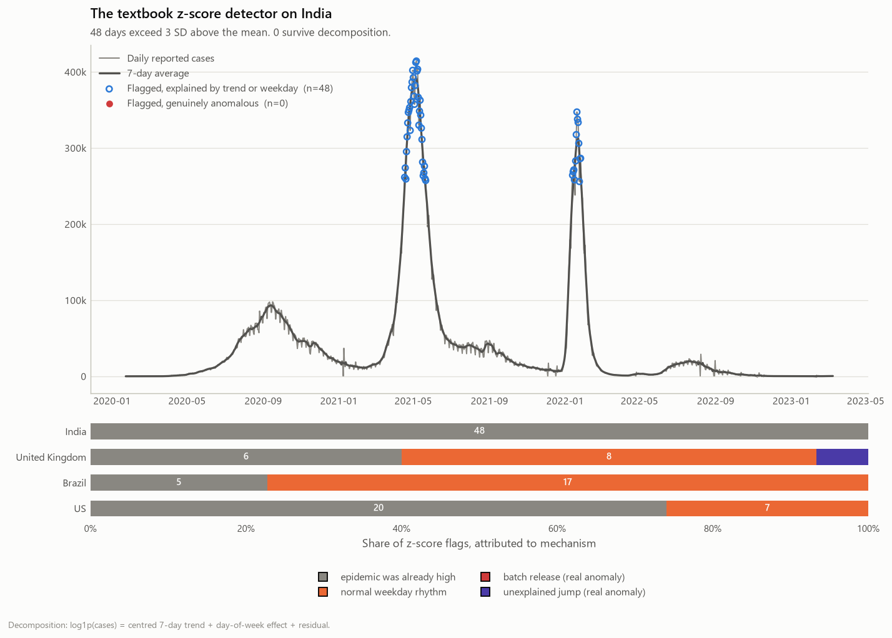
</picture>

You can see the flags sitting right on the two wave peaks. The detector is just
finding the epidemic again.

### What the weekly rhythm shows

Divide each day by the centred 7-day mean and the epidemic drops out, leaving the
reporting schedule. I used a permutation test on the day-of-week labels for
significance, since the ratios are heavy-tailed and an F-test would be wrong.

<picture>
  <source media="(prefers-color-scheme: dark)" srcset="reports/figures/forensics_weekday_fingerprints.dark.png">
  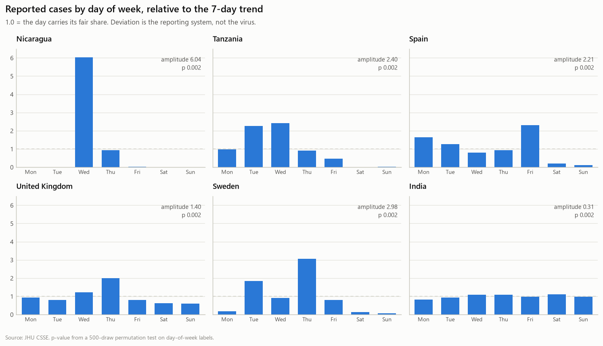
</picture>

Three that come straight out of the numbers:

- **Nicaragua**, multipliers `[0, 0, 6.04, 0.94, 0.03, 0, 0]`. The government
  published once a week, on Wednesdays.
- **Tanzania**, reporting falls to zero and then stops. This lines up with the
  2020 period when the state denied there was an epidemic.
- **Spain**, Saturday 0.19x and Sunday 0.11x. The weekend just wasn't counted.

**145 of 184 countries** have a significant weekday effect. Any model trained on
raw daily counts is partly fitting office hours.

### Digit tests

Two tests with different assumptions. Leading digits of a quantity spanning
several orders of magnitude should follow Benford's law. Final digits of any
count above 100 should be uniform on 0-9. The second is stronger evidence,
because it needs no assumption about the underlying process at all.

<picture>
  <source media="(prefers-color-scheme: dark)" srcset="reports/figures/forensics_digit_tests.dark.png">
  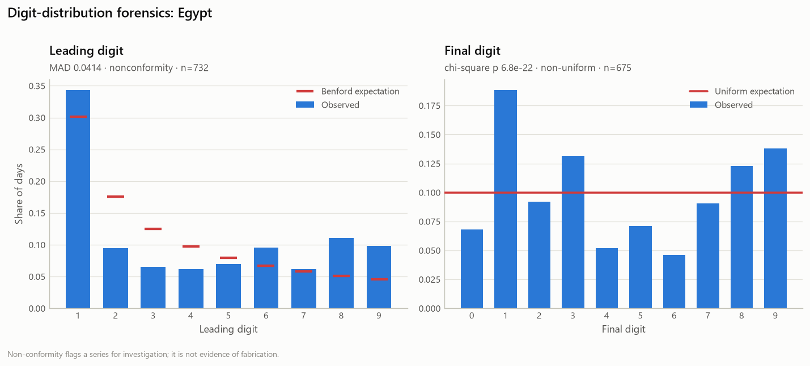
</picture>

Egypt has the strongest final-digit signal in the set: chi-square **p = 6.8e-22**
against uniformity, plus Benford non-conformity at MAD 0.041. A final digit
carries no information in a real count, so a distribution this skewed means the
numbers were rounded, estimated or typed rather than counted.

This flags a series for a look. It is not evidence of fabrication, and Benford
(the weaker test) gets the lowest weight of the seven.

### The Data Reliability Index

Seven detectors, severity-capped and weighted into a 0-100 score: negative
revisions, reporting gaps, constant-fill runs, backlog dumps, weekday batching,
final-digit heaping, Benford non-conformity.

<picture>
  <source media="(prefers-color-scheme: dark)" srcset="reports/figures/forensics_reliability_ranking.dark.png">
  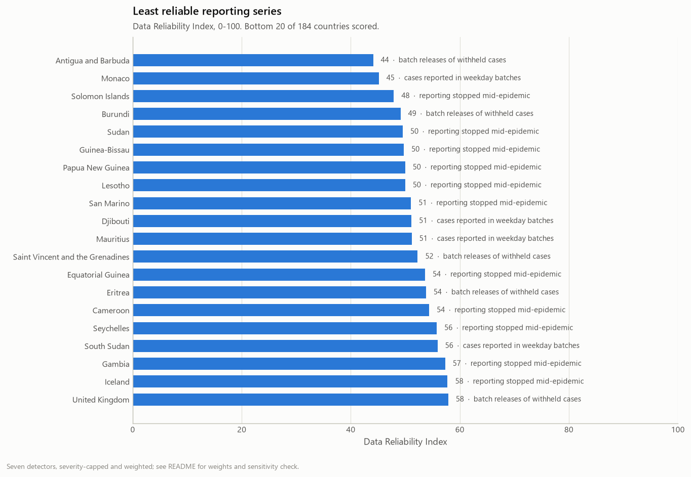
</picture>

The weights are my judgement, so I tested whether the ranking depends on them.
Redrawing the weight vector 500 times from a Dirichlet centred on my choices
gives a **median Spearman rho of 0.958** against the published ranking (5th
percentile 0.880). The ordering is coming from the data, not from me.

The UK showing up in the bottom 20 isn't a bug. It moved to weekly batch
reporting in 2022, and the dump detector flags that 27 times.

| | Countries |
|---|---|
| Impossible negative daily counts | 77 |
| Reporting stopped mid-epidemic (3+ days) | 147 |
| Series padded with a constant value | 40 |
| Significant weekday batching | 145 |
| Benford non-conformity | 131 |

One thing worth flagging: **17 countries were excluded** for having too few
active reporting days to score at all. Tanzania and Nicaragua are on that list.
So the countries with the worst data are the ones the index can't rank. That's a
real hole, and the exclusion list is published alongside the scores.

---

## 2. Forecasting

> *Can we predict the growth of the epidemic?*

I forecast the 7-day trailing average at 7 and 14 days out. **30,384 forecasts**
across 5,064 tasks: 40 countries, up to 74 rolling origins, 2 horizons, 6 models,
skipping stretches with almost no transmission.

Scoring is **Weighted Interval Score**, the metric the US and European COVID-19
Forecast Hubs used. It penalises overconfidence, which plain accuracy doesn't.

Forecasting the 7-day average rather than the raw daily count is a direct
consequence of Part 1. Raw counts are mostly reporting schedule.

<picture>
  <source media="(prefers-color-scheme: dark)" srcset="reports/figures/forecast_skill_ranking.dark.png">
  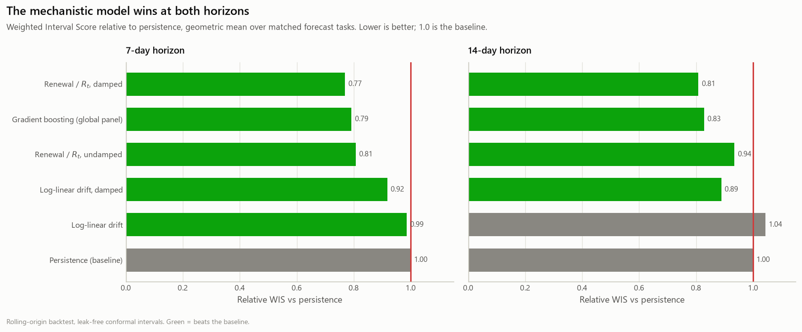
</picture>

| Model | rel. WIS @7d | rel. WIS @14d |
|---|---|---|
| **Renewal / R_t, damped** | **0.769** | **0.808** |
| Gradient boosting (global panel) | 0.792 | 0.828 |
| Renewal / R_t, undamped | 0.807 | 0.935 |
| Log-linear drift, damped | 0.918 | 0.888 |
| Log-linear drift | 0.986 | 1.043 |
| Persistence (baseline) | 1.000 | 1.000 |

The mechanistic model wins by 23% at 7 days. The gradient-boosted panel model,
with nine engineered features and 40 countries of training data, doesn't beat it.
Undamped log-linear extrapolation at 14 days scores 1.043, so it's worse than
doing nothing.

### Where the skill actually comes from

<picture>
  <source media="(prefers-color-scheme: dark)" srcset="reports/figures/forecast_regime_skill.dark.png">
  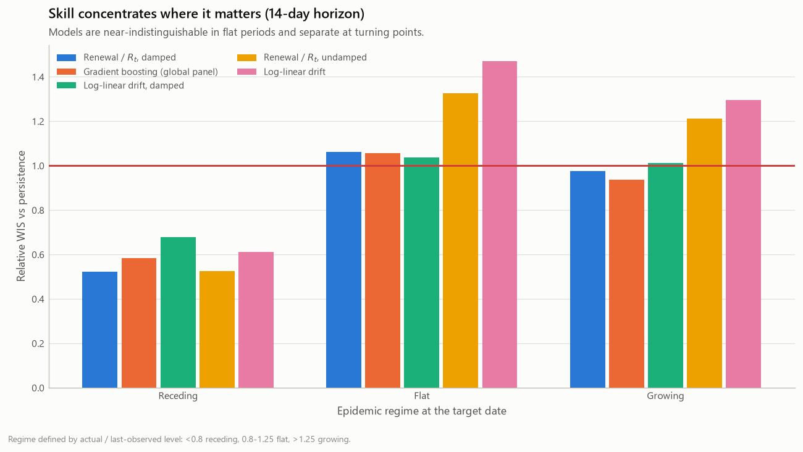
</picture>

Split the 14-day results by what the epidemic was doing and the headline falls
apart:

| Regime | Best model | rel. WIS |
|---|---|---|
| Receding | Renewal / R_t, damped | **0.523** |
| Growing | Gradient boosting | 0.936 |
| Flat | none beat persistence | ≥ 1.000 |

Almost all the measured skill is in declining epidemics, where the renewal model
correctly extrapolates decay. When cases are **growing**, which is the only time
a forecast changes a decision, the best model improves on persistence by 6%. In
flat periods every model is worse than doing nothing.

An average over all conditions hides this entirely.

### The intervals are too narrow, and I measured by how much

<picture>
  <source media="(prefers-color-scheme: dark)" srcset="reports/figures/forecast_calibration.dark.png">
  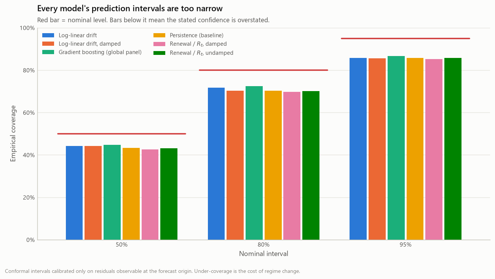
</picture>

Every model's 95% interval covers about **85%** of outcomes. The 50% interval
covers **43-45%**.

The intervals are conformal, built only from residuals that were observable at
each forecast origin. Split conformal guarantees coverage under exchangeability,
and epidemic residuals are not exchangeable across variant waves. The
under-coverage is how big that violation is. I'd rather report the gap than
assume it away.

### The full track record, misses included

<picture>
  <source media="(prefers-color-scheme: dark)" srcset="reports/figures/forecast_track_record.dark.png">
  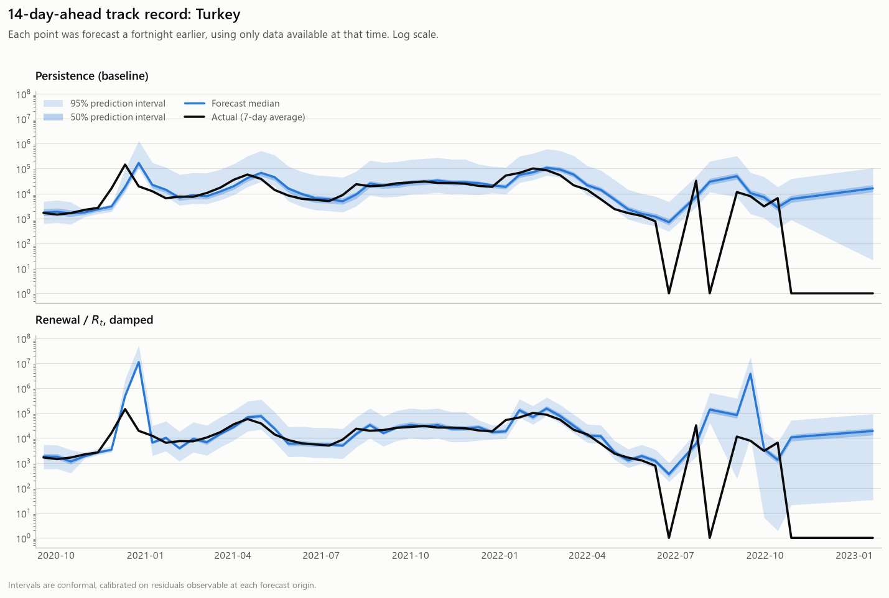
</picture>

Every 14-day forecast plotted at the date it was forecasting, not the date it was
made. Three things show up because I didn't cherry-pick a window. Both models
track well for eighteen months. The renewal model overshoots by two orders of
magnitude in January 2021, extrapolating a rise that then turned over. And from
mid-2022 both collapse, because Turkey's reported cases collapse to zero.

That last one isn't a modelling failure. It's Part 1 showing up inside Part 2.

### Data quality predicts forecastability

Joining the reliability index from Part 1 to per-country forecast skill:

<picture>
  <source media="(prefers-color-scheme: dark)" srcset="reports/figures/forecast_quality_vs_skill.dark.png">
  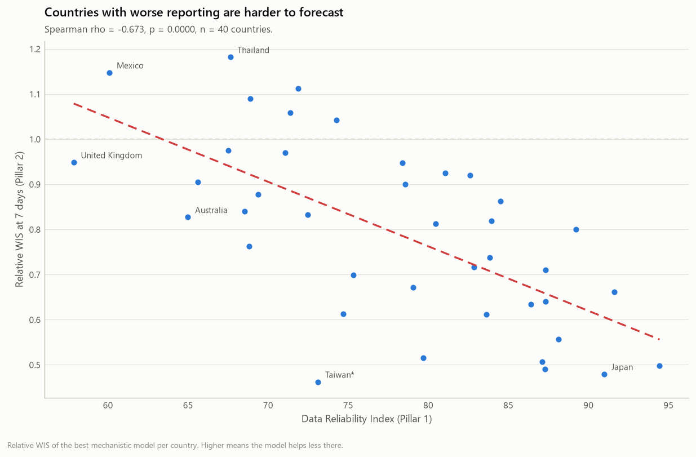
</picture>

**Spearman rho = −0.673, p = 2.0e-06, n = 40.** Where reporting is better,
modelling adds more over a naive baseline. Data quality isn't a step you get past
before the real work. It caps how well the real work can do.

---

## 3. Causal analysis

> *Can you find, in a data-driven manner, why certain regions did much better
> than others, and apply causal modelling to identify potential factors?*

Short answer: not from cross-country observational data. Below is why, tested
rather than asserted.

I wrote the causal graph down first, then derived the adjustment set from it with
Pearl's back-door criterion. The criterion is implemented in code and unit
tested, so the adjustment set is a consequence of the graph rather than a
convenient choice.

<picture>
  <source media="(prefers-color-scheme: dark)" srcset="reports/figures/causal_dag.dark.png">
  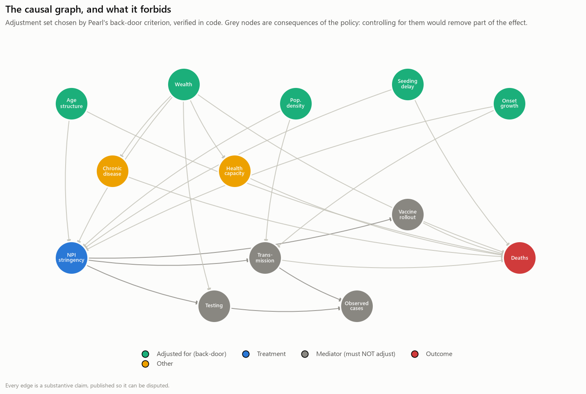
</picture>

It refuses four variables a naive analysis would control for: testing,
transmission, observed cases, vaccination speed. All four are consequences of the
policy. Conditioning on a mediator deletes part of the effect you're trying to
measure.

Design: treatment is mean OxCGRT stringency over the 60 days after each country's
100th case. Outcome is log deaths per million over the following year. 148
countries have complete covariates. 27 get dropped, which skews the sample richer,
so the estimate is for countries with complete data and not the world.

<picture>
  <source media="(prefers-color-scheme: dark)" srcset="reports/figures/causal_estimate_ladder.dark.png">
  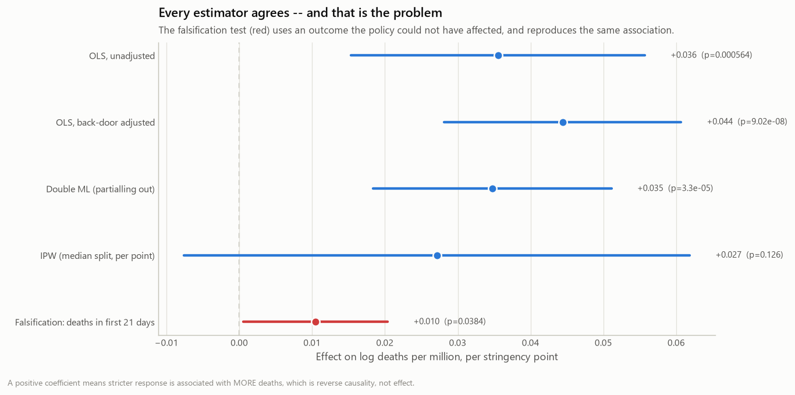
</picture>

All four estimates are per stringency point so they sit on one scale. The IPW
estimate is natively the effect of crossing the median, a 23-point jump, so I
divide by that contrast. Putting the raw version next to regression coefficients
would compare different units.

| Estimator | Effect | 95% CI | p |
|---|---|---|---|
| OLS, unadjusted | +0.0355 | [+0.015, +0.056] | 5.6e-04 |
| OLS, back-door adjusted | +0.0444 | [+0.028, +0.061] | 9.0e-08 |
| **Double ML (cross-fitted)** | **+0.0347** | [+0.018, +0.051] | 3.3e-05 |
| IPW (median split, per point) | +0.0271 | [−0.008, +0.062] | 0.126 |

Four estimators with different assumptions agree: a stricter early response goes
with **more** deaths. A 10-point stringency increase maps to a risk ratio of 1.42.

### And every robustness check passes

| Test | Result | Verdict |
|---|---|---|
| Placebo treatment (40 permutations) | mean +0.0009 vs observed +0.0347, perm. p = 0.024 | pass |
| Random common cause (30 draws) | estimate shifts 0.8% | pass |
| Subset stability (60 × 80% subsamples) | 100% sign consistency, [+0.025, +0.044] | pass |
| Leave-one-continent-out | +0.020 to +0.043, sign stable | pass |
| E-value | 2.18 (CI limit 1.69) | moderate |

**4 out of 4 pass, and the estimate is still not causal.**

This is the main methodological point of the project. Robustness checks measure
whether an estimate is *stable*. They say nothing about whether it's
*identified*. An estimate driven entirely by reverse causality is perfectly
stable, survives every placebo, and carries a respectable E-value.

So I tested identification directly. Regressing treatment on the outbreak size
*during* the policy window gives **+2.26 (p = 0.032)**. Governments clamped down
harder where the epidemic was worse. Treatment and outcome are decided at the
same time by the same thing, and no amount of adjusting for fixed country traits
separates them.

The pipeline writes its own verdict:

> The design does NOT identify a causal effect. […] The reported coefficient is a
> measure of which countries were already in trouble when they acted.

The positive sign is the giveaway. Reading +0.035 as "lockdowns increased deaths"
points the arrow backwards.

### The comparison the brief asks for

<picture>
  <source media="(prefers-color-scheme: dark)" srcset="reports/figures/causal_india_regional.dark.png">
  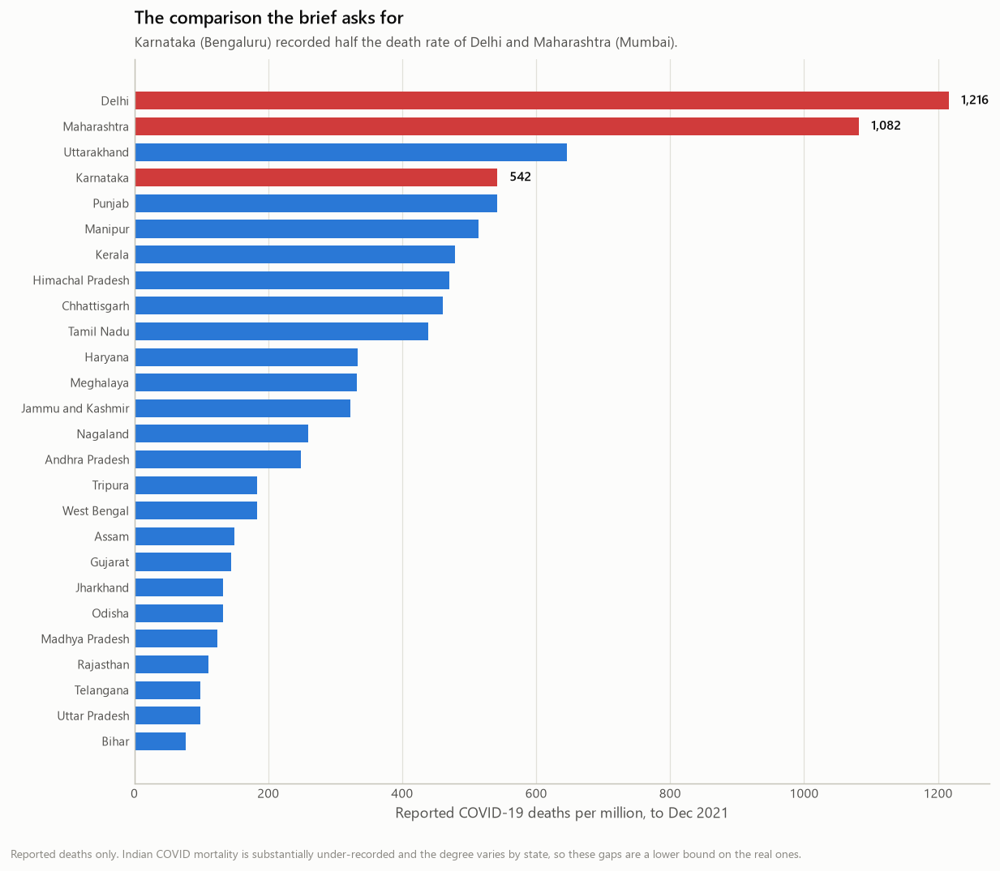
</picture>

| State | Cases / M | Deaths / M | CFR |
|---|---|---|---|
| Delhi | 69,731 | **1,216** | 1.74% |
| Maharashtra (Mumbai) | 51,349 | **1,082** | 2.11% |
| Karnataka (Bengaluru) | 43,047 | **542** | 1.26% |

Karnataka recorded about half the death rate of Delhi and Maharashtra. Two
caveats that matter more than the gap itself. Indian COVID mortality is heavily
under-recorded and the shortfall varies by state, so these are lower bounds. And
a gap between three numbers is not an explanation.

To get an explanation I fitted a **synthetic control** for Maharashtra's 4-5 April
2021 restrictions, which came 2-3 weeks before the other large states. It returns
a null, on a design that can't support reading anything into it. Post/pre RMSPE
ratio 0.94. Placebo permutation p-value 1.00. A fake intervention 45 days earlier
produces a *bigger* apparent effect, ratio 1.59.

<picture>
  <source media="(prefers-color-scheme: dark)" srcset="reports/figures/causal_synthetic_control.dark.png">
  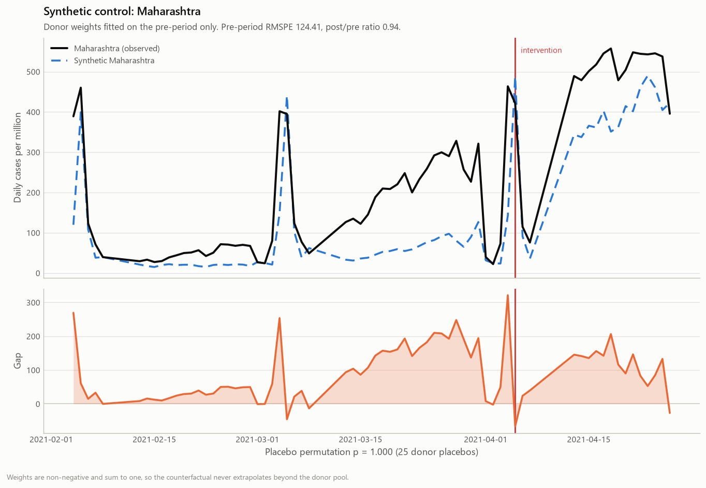
</picture>

The figure shows the problem. The gap between Maharashtra and its synthetic twin
opens in mid-March, three weeks before the intervention line. So the post-period
gap is measuring divergence that was already happening. If the donors never
tracked the treated unit beforehand, there's no counterfactual to compare to.

Reported as a failed attempt at identification, not as evidence of no effect.
Those are different claims.

**What would actually work here:** staggered adoption across many units with
matched pre-trends, a regression discontinuity at a policy threshold, or an
instrument for policy timing that isn't correlated with local severity.
District-level Indian data with genuinely staggered restriction dates is the most
promising route.

---

## 4. Hospital capacity

> *Which areas should be boosting their hospital beds soon?*

Cases convolve into admissions using an infection-hospitalisation ratio and an
admission lag. Admissions convolve into ICU census using a length-of-stay
**survival** curve: the probability a patient admitted *s* days ago is still there.

<picture>
  <source media="(prefers-color-scheme: dark)" srcset="reports/figures/capacity_kernels.dark.png">
  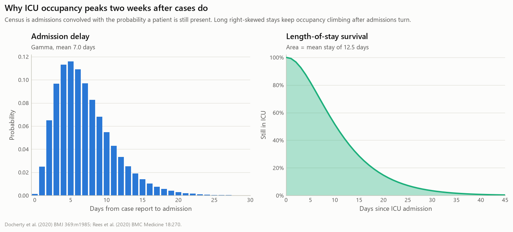
</picture>

That second step is what a regression on cases can't reproduce. Occupancy is not
a scaled copy of admissions. Stays are long and right-skewed, so census keeps
climbing after admissions have turned. Across 202 countries the median lag from
case peak to ICU peak is **13 days**. That's the warning the model buys you.

### Validated, including where it breaks

<picture>
  <source media="(prefers-color-scheme: dark)" srcset="reports/figures/capacity_validation.dark.png">
  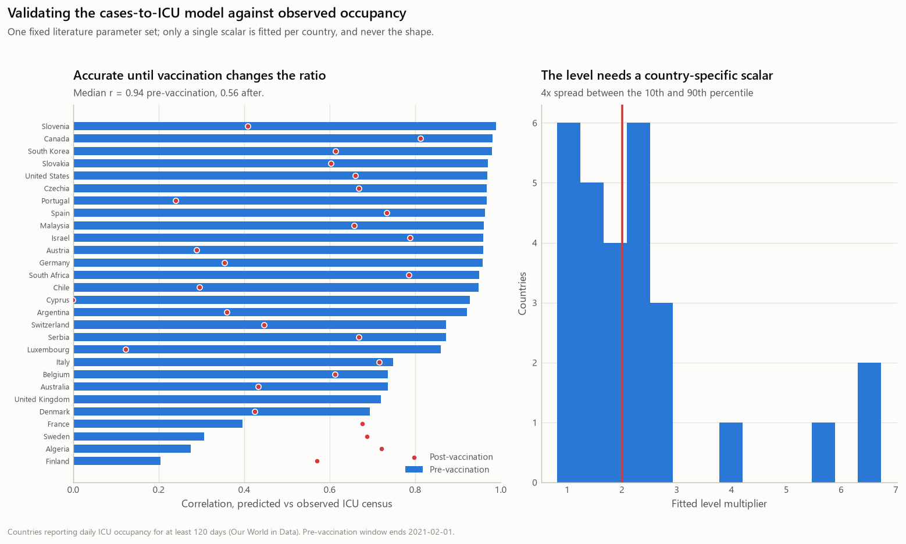
</picture>

Checked against observed daily ICU occupancy, using literature parameters with no
per-country tuning of shape:

| Period | Countries | Median r |
|---|---|---|
| Pre-vaccination (to Feb 2021) | 28 | **0.938** |
| Post-vaccination (from Jul 2021) | 38 | 0.565 |

The drop is the model's own assumption failing on cue. A fixed
infection-hospitalisation ratio can't survive vaccination changing it. Pooling
both periods gives r = 0.37, a number that describes neither and makes a working
model look broken.

Only one scalar is fitted per country. Its **4.5x spread** between the 10th and
90th percentile is itself an estimate of how differently countries were detecting
infections, since the assumed IHR is held constant across them.

### The triage output

<picture>
  <source media="(prefers-color-scheme: dark)" srcset="reports/figures/capacity_triage.dark.png">
  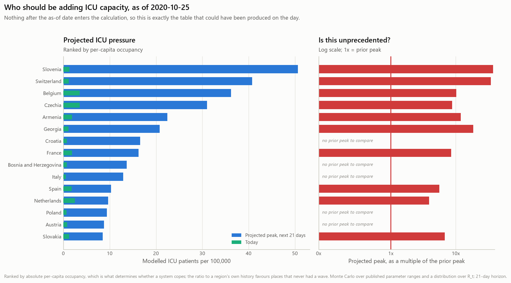
</picture>

Run as of **25 October 2020**, using nothing after that date. Slovenia,
Switzerland, Belgium and Czechia come out on top. All four went on to be among
the most strained health systems in Europe that winter.

I rank by projected ICU census **per 100,000**, not by the ratio to a region's own
history. The ratio sounds like the better question and isn't: a region going from
0.1 to 2 patients per 100k tops a ratio ranking while needing no help at all.

<picture>
  <source media="(prefers-color-scheme: dark)" srcset="reports/figures/capacity_fan.dark.png">
  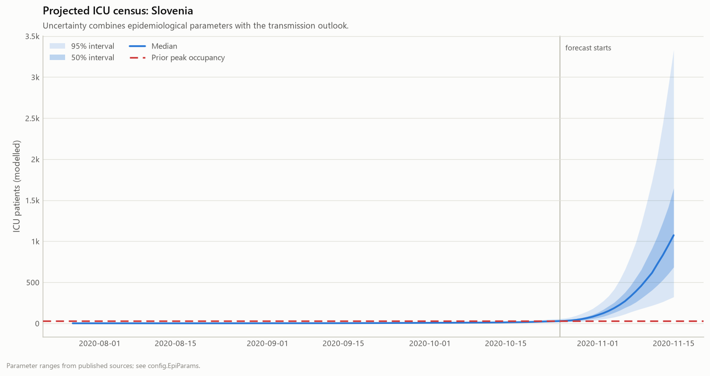
</picture>

Slovenia was top-ranked on that date. Median projection is about 1,070 ICU
patients within three weeks, against a prior peak near 30, with a 95% band from
roughly 330 to 3,300. The band is wide because it carries published uncertainty
in hospitalisation rate, critical-care share, admission lag and length of stay,
plus a distribution over R_t. Even the bottom of that band is ten times anything
the country had handled, which is enough to act on.

---

## Limitations

Things that didn't work, and things I'd want a reader to discount.

**The population-scaling diagnostic found nothing.** I built it to catch
correlations that are really just "big regions have more of everything". Run on
cases against deaths across Indian states it gives raw r = 0.905, partial r
holding log population fixed = 0.886, per-capita r = 0.704. The association
survives every adjustment, so it's real, and the tool says so. A diagnostic that
can only agree with the suspicion behind it isn't a diagnostic. The problem it
does catch is narrower: it shows up when one variable is *defined* as a share of
population, which `mechanical_scaling_demo` builds explicitly.

**One of the two identification probes has no power.** The lagged probe tests
case growth *before* the policy window, when nearly every country still has a
short and noisy series, so its null means nothing. The concurrent probe, outbreak
size *during* the window, is the one that can detect simultaneity, and it fires
at p = 0.032. Both are reported with the caveat that they can reveal confounding
but never rule it out.

**The synthetic control is a null on a design that can't be read.** Covered above,
including the figure that shows why.

**Two bugs, both of which looked like something else.** The capacity model first
scored r = 0.37, which reads as "the model doesn't work". The evaluation was
averaging pre- and post-vaccination periods together. Separating them gave 0.94
and the more interesting finding about what vaccination does to a fixed IHR.
Separately, swapping in a smaller forest to speed up the refutation stage made
every refutation return nothing, and the pipeline printed "0 of 0 checks passed"
as if that were a result. `learner or default()` truth-tests a scikit-learn
ensemble, which raises on an unfitted model. Both now have regression tests, and
`run_suite` raises instead of letting an empty suite read as a clean one.

**Scope.** The backtest covers the 40 largest epidemics, so skill on small
outbreaks is unmeasured. The India state series ends December 2021.

---

## Reproducing

```bash
git clone https://github.com/Yugverma17/Pandemic-Data-Science.git
cd Pandemic-Data-Science
python -m venv .venv && .venv/Scripts/activate   # Linux/macOS: source .venv/bin/activate
pip install -r requirements-dev.txt && pip install -e .
```

Stages are independent and cache aggressively. Each writes to `reports/`.

```bash
python scripts/run_all.py
```

Or one at a time:

```bash
python scripts/fetch_data.py        # ~150 MB, cached with SHA-256 provenance
python scripts/run_forensics.py     # ~2 min
python scripts/run_forecast.py      # ~7 min   (--rescore reuses the backtest)
python scripts/run_causal.py --fast # ~20 min  (without --fast: ~60 min, 150 placebo draws)
python scripts/run_capacity.py      # ~5 min
```

The refutation suite dominates the causal stage. It refits the double-ML
estimator about 136 times, which is what testing an estimate costs. `--fast` cuts
to 40 placebo draws, and that's what produced the figures here.

Everything is seeded and deterministic. Data is fetched once, verified by
SHA-256, and logged in `data/raw/manifest.json` with URL, byte count and
timestamp, so any result traces back to the exact bytes behind it.

---

## Engineering

```
src/pandemic/
├── config.py          Paths, seeds, epidemiological parameters with citations
├── data/              Cached fetch with provenance manifest; tidy loaders
├── forensics/         Digit tests, structural flags, scorecard, naive benchmark
├── forecast/          R_t (Cori et al.), models, conformal calibration, backtest
├── causal/            DAG + back-door, DML, IPW, refutation, synthetic control
├── capacity/          Convolution kernels, validation, Monte Carlo risk
└── viz/               Themed plotting; every figure renders light and dark
```

**101 tests, no network needed.** They all run on synthetic data where I already
know the right answer, so an upstream schema change can't quietly disable them.

The ones that matter:

- `test_rt_estimate_is_causal`: the backtest computes R_t once per country and
  indexes into it, which is only valid if R_t at index *i* ignores everything
  after *i*. The test perturbs the future and checks the past is bit-identical.
- `test_dml_recovers_effect_under_nonlinear_confounding`: data simulated from a
  known model where linear adjustment is biased by construction. DML recovers the
  planted coefficient to ±0.06, and a companion test confirms OLS doesn't.
- `test_adjusting_for_a_mediator_is_rejected`: the back-door criterion has to
  refuse post-treatment variables.
- `test_wis_matches_hand_calculation`: the headline metric against arithmetic I
  did by hand.
- `test_naive_zscore_flags_the_wave_peak_not_anomalies`: Part 1's main claim, as
  a runnable assertion on a clean synthetic epidemic.
- `test_dml_accepts_a_custom_learner`: regression test for the bug that emptied
  the refutation suite while reporting success.

CI runs lint and the full suite on Python 3.11, 3.12 and 3.13, plus a job that
imports every module and checks each stage's CLI.

**Three decisions worth explaining.** Forecast models read a precomputed
`SeriesCache`, which is only safe because every quantity they use is causal, and
the test suite checks that rather than trusting it. Predictive intervals all come
from one shared conformal layer instead of each model's own uncertainty story, so
a WIS difference reflects the forecast and not the error bars. Residuals sit in a
pending queue and are released only when the clock reaches their target date,
because calibrating on residuals you couldn't have seen yet gives you coverage
that disappears in production.

### Sources

Our World in Data ([Mathieu et al. 2021](https://doi.org/10.1038/s41562-021-01122-8)) ·
JHU CSSE ([Dong, Du & Gardner 2020](https://doi.org/10.1016/S1473-3099\(20\)30120-1)) ·
COVID19-India API · World Mortality Dataset ([Karlinsky & Kobak 2021](https://doi.org/10.7554/eLife.69336))

### Methods

R_t: [Cori et al. 2013](https://doi.org/10.1093/aje/kwt133) ·
WIS: [Bracher et al. 2021](https://doi.org/10.1371/journal.pcbi.1008618) ·
DML: [Chernozhukov et al. 2018](https://doi.org/10.1111/ectj.12097) ·
Back-door: [Pearl 1995](https://doi.org/10.1093/biomet/82.4.669) ·
Synthetic control: [Abadie, Diamond & Hainmueller 2010](https://doi.org/10.1198/jasa.2009.ap08746) ·
E-value: [VanderWeele & Ding 2017](https://doi.org/10.7326/M16-2607) ·
ICU LOS: [Rees et al. 2020](https://doi.org/10.1186/s12916-020-01726-3)

---

MIT licensed. Built by [Yug Verma](https://github.com/Yugverma17).
